<!DOCTYPE html>
<html lang="en">
<head>
  <meta charset="UTF-8" />
  <meta name="viewport" content="width=device-width, initial-scale=1.0"/>
  <title>Matthieu's Toolbox</title>
  
</head>
<body>

  <h2>Hi 👋, I'm Matthieu</h2>
  <h3>Industrial engineer in Automation and Robotics, currently PhD student in Machine Learning applied to Genetics</h3>
  

    🔭 I’m currently working on polishing my machine learning skills 
    📫 Reach me at: <a href="mailto:m.c.de.hemptinne@vu.nl">m.c.de.hemptinne@vu.nl</a>
  

  <h1 style="text-align: center;">🧰 Current Toolbox</h1>

  

    <!-- Hardware & Version Control -->
    

      

        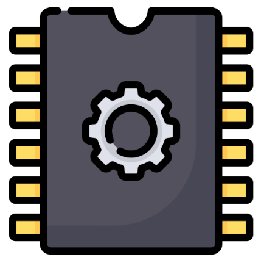
        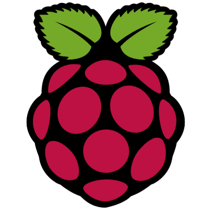
        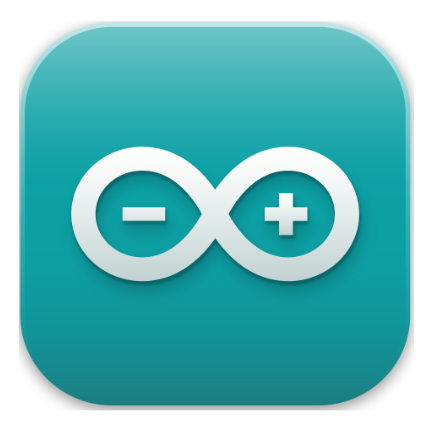
        
      

      

        
        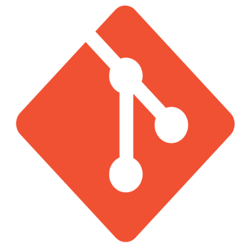
      

      

        
        
        
      

    

    <!-- Web + Cloud -->
    

      

        
        
        
        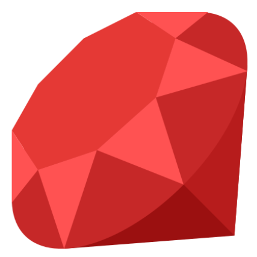
      

      

        
        
      

      

        
        
        
      

    

    <!-- Programming + Stats -->
    

      

        
        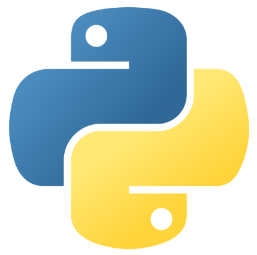
        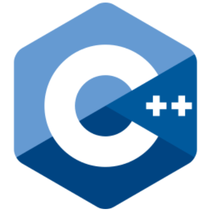
      

      

        
        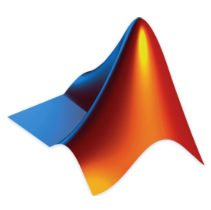
        
      

    

    <!-- ML + Containers -->
    

      

        
        
        
      

      

        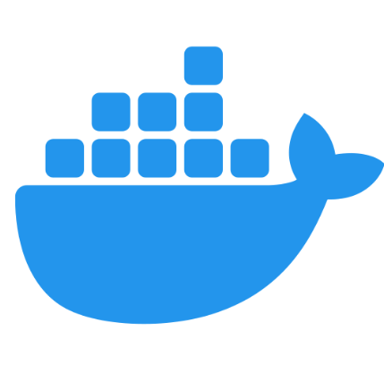
        
      

    

    <!-- Vision, Modeling, Robotics -->
    

      

        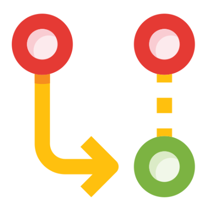
        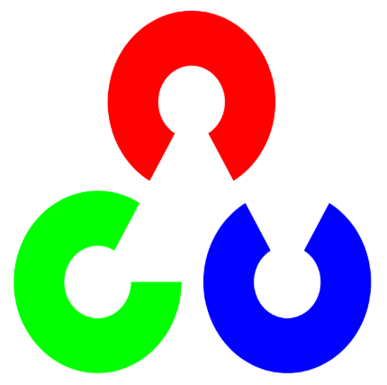
      

      

        
        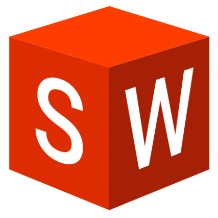
        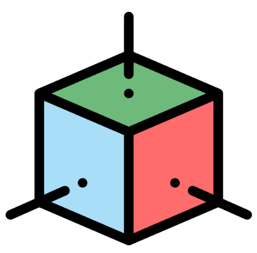
      

      

        
        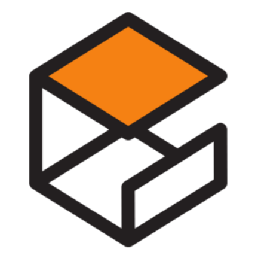
        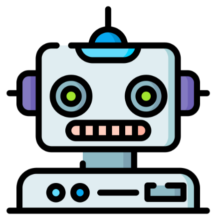
      

    

  

</body>
</html>
