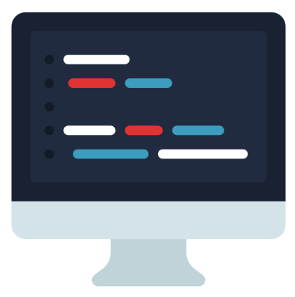

<h2 align="center">Hi 👋, I'm Matthieu</h2>
<h3 align="center">Industrial engineer in Automation and Robotics, currently PhD student in Machine Learning applied to Genetics</h3>

  🔭 I’m currently polishing my machine learning skills 
  📫 Reach me at: <a href="mailto:m.c.de.hemptinne@vu.nl">m.c.de.hemptinne@vu.nl</a>

---

<h3 align="center">🧰 Toolbox</h3>

   
  
  
  
  
  
  

  <!-- ML Libraries -->
  
  
  

  <!-- Tools -->
  
  
  
  
  
  
  

  <!-- Robotics & Modeling -->
  
  
  
  
  
  

